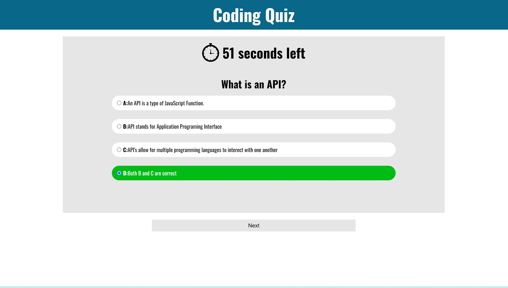

# Coding Quiz

## Description
This is a timed coding quiz with five questions timed for 60 seconds. If you answer a question correctly, it adds 10 seconds and if you get a question wrong, it subtracts 10 seconds. If the time runs out, the game ends and you get whatever score you end with. Each question grants 10 points for up to a max score of 50 points. You are asked at the end to enter your name and press the ok button which will add your name and score to the last score in local storage. 

Take the quiz from [Here](https://dawsonbolen.github.io/coding-quiz/)
View the repo from [Here](https://github.com/DawsonBolen/coding-quiz)

## Installation
NA

## Usage
This could be used by employers who wish to validate candidates for a position as well as potential candidates who wish to prepare for a quiz. 

## Credits
NA

## License 
MIT